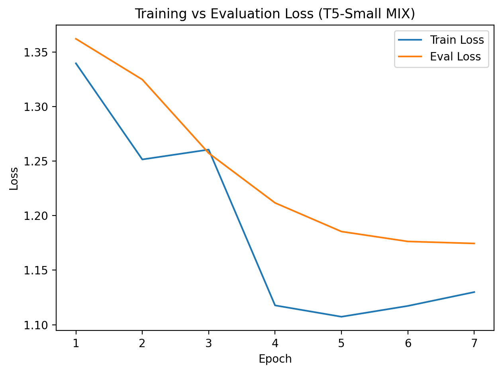
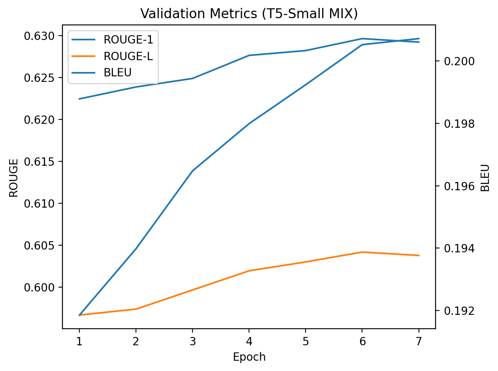

# Paraphrase Generation System

This project builds a full pipeline for generating paraphrases with a sequence-to-sequence Transformer. It covers training, evaluation, and deployment through a simple REST API that can rewrite sentences into alternative phrasings.

## Overview

The model was fine-tuned on several paraphrase datasets to teach it how to restate text in different ways. I started with QQP (Quora Question Pairs) which gave strong metric scores but often turned every output into a question. I then tried PAWS and MRPC, which were smaller and tended to just repeat the input sentence.  

The best results came from combining all three into a single shuffled mixture with capped sizes. That setup matched the QQP metrics while avoiding the “everything becomes a question” issue.

## Why These Choices

QQP, MRPC, and PAWS are all publicly available, clean, and relatively lightweight. Perfect for a short fine-tuning project. They cover both formal and conversational text.  
Given more time, I’d move up to a larger model (T5-base or Flan-T5-large) and explore staged training: first on question-style data, then on more general paraphrase pairs to reduce the last bit of bias toward interrogative phrasing as well as increasing training epochs.

## Metrics

BLEU and ROUGE scores are logged for every run.

| Model           | BLEU   | ROUGE-1 | ROUGE-L | Notes |
|-----------------|--------|----------|----------|-------|
| T5-Small QQP    | 0.3170 | 0.6265  | 0.5957  | Tends to generate questions |
| T5-Small MRPC   | 0.2855 | 0.6038  | 0.5715  | Repeats input often |
| T5-Small PAWS   | 0.2761 | 0.6044  | 0.5689  | Similar to MRPC |
| T5-Small MIX    | 0.3157 | 0.6219  | 0.5919  | Balanced phrasing and solid scores |


Training Curve:



BLEU and ROUGE Metrics:


## Training Summary

Both the training and evaluation loss decreased across epochs, showing that the model was learning without overfitting.  
At the same time, the BLEU and ROUGE scores improved with each epoch, showing that the model’s outputs were getting clearer and closer in meaning to the originals.
Overall, the MIX run showed consistent progress in both loss reduction and text quality metrics.


## Useful Commands

Train a single dataset:
```bash
python -m paraphrase_gen.training.train \
  --model_name t5-small \
  --dataset_name glue \
  --dataset_config qqp \
  --output_dir runs/t5_small_qqp
```

Train a mixed dataset:
```bash
python -m paraphrase_gen.training.train --mix_default
```

Evaluate a model:
```bash
python -m paraphrase_gen.evaluation.evaluate --model_path runs/t5_small_mix
```

Run the API locally:
```bash
uvicorn paraphrase_gen.api.main:app --host 0.0.0.0 --port 8000
```

API Paraphrase request
```bash
curl -s -X POST http://localhost:8000/paraphrase \
  -H "Content-Type: application/json" \
  -d '{
        "inputs": ["I will follow up later today once I review the latest results from the test run."],
        "num_beams": 4,
        "max_new_tokens": 50,
        "min_new_tokens": 8,
        "no_repeat_ngram_size": 3,
        "repetition_penalty": 1.05
      }' | jq .
```

Launch the Streamlit demo:
```bash
streamlit run streamlit_app.py
```

## Tuning the Outputs

You can adjust a few decoding settings to trade off variety vs. precision:

- **num_beams** (≥1): higher = safer, more on-topic phrasing; lower = faster.
- **do_sample** (true/false): turn on for more diverse wording. When `true`, `num_beams` is ignored.
- **temperature** (0.5–1.5): lower = conservative, higher = seemingly more random (use with sampling).
- **top_p / top_k**: top option (`top_p`) or k-best (`top_k`) sampling. Reduce a bit (`top_p=0.9`) for cleaner outputs.
- **n_best** (1–5): return multiple results.
- **max_new_tokens / min_new_tokens**: control length of the paraphrase.
- **no_repeat_ngram_size** (0–5): prevents short phrase repeats (3 is a solid default).
- **repetition_penalty** (1.0–1.2): penalty for repeated tokens.

## Hugging Face Models

All paraphrase models trained for this project are also available on the Hugging Face Hub:

- [Paraphrase T5-Small MIX](https://huggingface.co/daanleiva/paraphrase-t5-small-mix)
- [Paraphrase T5-Small QQP](https://huggingface.co/daanleiva/paraphrase-t5-small-qqp)
- [Paraphrase T5-Small MRPC](https://huggingface.co/daanleiva/paraphrase-t5-small-mrpc)
- [Paraphrase T5-Small PAWS](https://huggingface.co/daanleiva/paraphrase-t5-small-paws)
